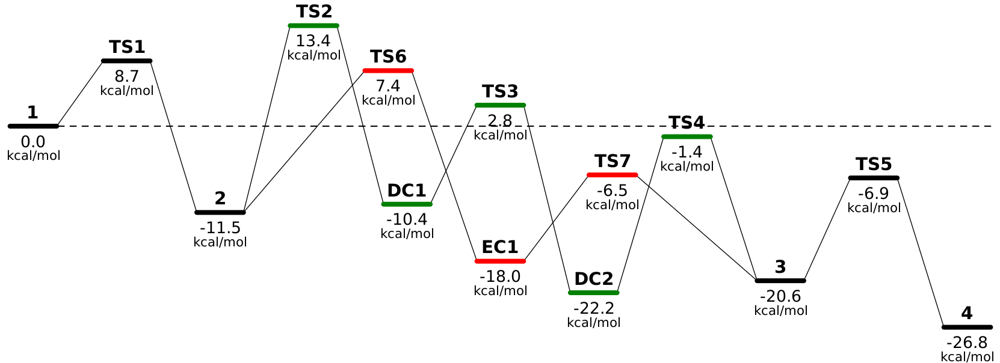

rxnplot
======

**rxnplot** es un paquete de Python 3 para dibujar diagramas de niveles de energía de reacciones químicas. Está basado en
[rxnlvl](https://github.com/eutactic/rxnlvl) pero tiene una sintaxis diferente y es compatible con documentos de Jupyter.

Instala rxnplot
---------------

Puedes instalar **rxnplot** en tu computadora con pip:

    pip install rxnplot

o puedes [abrir rxnplot en Binder](https://mybinder.org/v2/gh/qcuaeh/rxnplot.git/HEAD?labpath=examples) sin necesidad de instalar nada.

Construye un diagrama paso a paso
--------------------------------

Para crear un diagrama tendrás que usar Python, pero incluso si nunca lo has usado puedes aprender a construir diagramas rápidamente.

#### Primero importa el módulo

    from rxnplot import plot, energy

#### luego crea un objeto de gráfico

    p = plot(height=10.0, zero=energy(0.0, 'kjmol'), units='kcalmol', decimals=1, qualified=True)
    
El objeto *plot* representa un diagrama inicialmente en blanco y requiere como argumentos:

- *height* - el tamaño vertical del gráfico en cm.
- *bgcolor* - el color de fondo de la imagen o `None`. Si es `None`, el fondo será transparente.
- *zero* - un objeto *energy* que representa el cero de las energías relativas.
- *units* - las unidades de energía del diagrama.
- *decimals* - el número de decimales que se usarán para mostrar las energías en el diagrama.
- *qualified* - si es `True`, se mostrarán las unidades de energía en el diagrama, de lo contrario sólo se mostrarán los valores numéricos.

El objeto *energy* requiere dos argumentos: la energía como un número de punto flotante y las unidades.

Las unidades de energía pueden ser `'kjmol'` (kilojulios por mol), `'eh'` (hartrees), `'ev'` (electronvoltios), `'kcalmol'` (kilocalorías por mol) o
`'wavenumber'` (números de onda).

Los colores deben ser [nombres de colores SVG](https://upload.wikimedia.org/wikipedia/commons/2/2b/SVG_Recognized_color_keyword_names.svg). 

Ahora puedes empezar a agregar elementos al gráfico.

#### puedes incluir una línea base (esto es opcional)

    p.new_baseline(color='black', mode='dashed', opacity=0.1)

El método *new_baseline* crea una línea que representa el cero de energía y requiere como argumentos:

- *color* - el color de la línea base.
- *mode* - controla la apariencia de la línea base, puede ser `'normal'` o `'dashed'`.
- *opacity* - un flotante entre 0.0 y 1.0 que representan la opacidad de la línea base.

#### finalmente define los niveles de energía

    p.new_level('1', energy(0.0, 'kcalmol'))
    p.new_level('TS1', energy(8.1, 'kcalmol'), color='green')
    p.new_level('2', energy(-6.4, 'kcalmol'))
    p.new_branch('1')
    p.new_level('TS2', energy(12.6, 'kcalmol'), color='red')
    p.add_level('2')

El método *new_level* agrega un nuevo nuevo nivel de energía y requiere como argumentos:

- *name* - el nombre del nivel, que debe ser único.
- *energy* - un objeto *energy* que representa la energía relativa del nivel.
- *offset* - el desplazamiento horizontal del nivel respecto al nivel anterior (el valor por defecto es 1.0).
- *color* - el color del nivel (el valor por defecto es `'black'`).

El método *add_level* agrega un nuevo nivel de energía existente y requiere como argumentos:

- *name* - el nombre del nivel.

El método `new_branch` inicia una nueva rama del perfil y requiere como argumentos:

- *name* - el nombre del nivel.

#### y visualiza el diagrama

    p.render()

#### o guarda el diagrama en un archivo

    p.write('diagrama.png')

El método write acepta la opción *scale*:

    p.write('diagrama.png', scale=2)

y también crea archivos PDF:

    p.write('diagrama.pdf')
